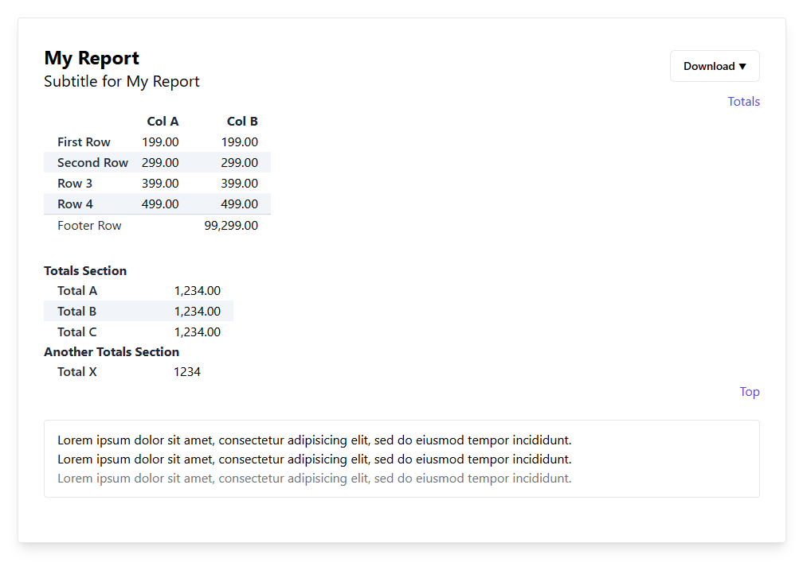

# Package under construction: package-lara-report-table

## Installation

```bash
composer require christoferd/package-lara-report-table
```

You can publish the config file with:

```bash
php artisan vendor:publish --tag="package-lara-report-table-config"
```

This is the contents of the published config file:

```php
return [
    'jump_to_totals_link_label' => 'Totals',
    'jump_to_top_link_label' => 'Top',
];
```

## Usage

```php
$laraReportTable = new Christoferd\LaraReportTable();

$r = new LaraReportTable();

$r->addReportTitle('My Report');
$r->addReportTitle('Subtitle for My Report');

$r->setColTitles(['Col A', 'Col B']);

$r->addRowTitle('First Row');
$r->addRow(nf(199), \nf(199.00));

$r->addRowTitle('Second Row');
$r->addRow(nf(299), \nf(299.00));

$r->addRowTitle('Row 3');
$r->addRow(nf(399), \nf(399.00));

$r->addRowTitle('Row 4');
$r->addRow(nf(499), \nf(499.00));

$r->addFooterRowTitle('Footer Row');
$r->addFooterRow('', \nf(99299.00));

$r->addTotals('Totals Section', [
    'Total A' => \nf(1234.002),
    'Total B' => \nf(1234.002),
    'Total C' => \nf(1234.002),
]);

$r->addTotals('Another Totals Section', [
    'Total X' => 1234.00,
]);

$r->addInformation('Lorem ipsum dolor sit amet, consectetur adipisicing elit, sed do eiusmod tempor incididunt.');
$r->addInformation('Lorem ipsum dolor sit amet, consectetur adipisicing elit, sed do eiusmod tempor incididunt.');
$r->addInformation('Lorem ipsum dolor sit amet, consectetur adipisicing elit, sed do eiusmod tempor incididunt.',
                   'text-gray-500');

$r->setShowLinkJumpToTotals(true);
$r->setShowBackToTopLink(true);

$r->setMenuLinks([
                     ['label' => 'CSV', 'url' => '/report-download'],
                     // ['label' => 'Excel', 'url' => '/report-download/my-cash-report/xls'],
                 ]);

$reportHtml = $r->renderHtml();

return view('report-view', compact('reportHtml'));
```

#### Expected Output


## Changelog

Under construction.

## License

MIT
